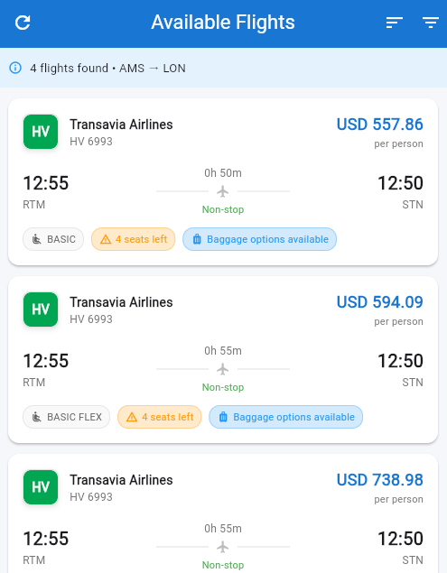
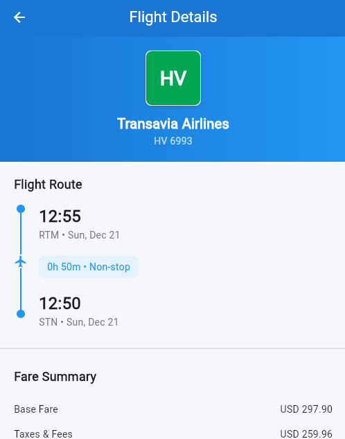
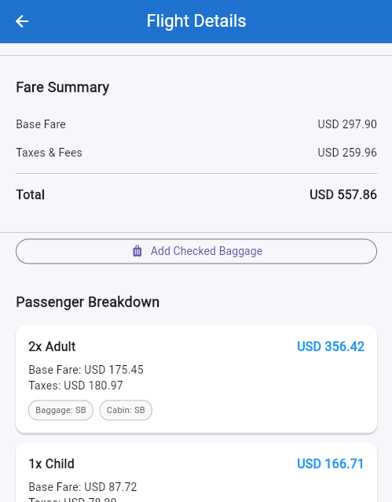
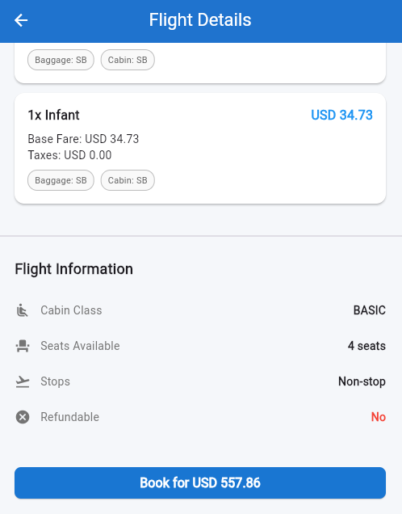
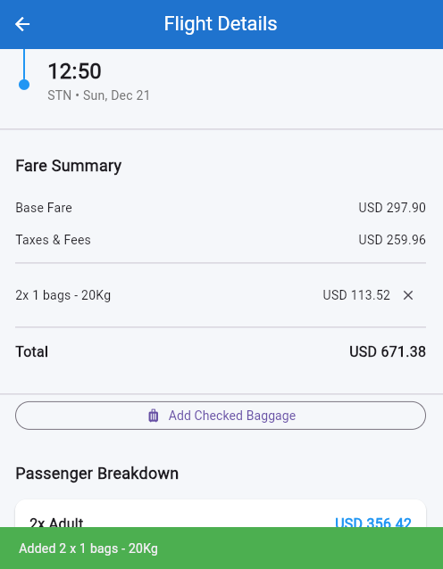

# Flutter Flight Booking App

A comprehensive Flutter application for browsing and booking flights, built with **Clean Architecture** and **BLoC** state management.

## Screenshots

<p float="left">
  
  
  
  
  
  
</p>

## 📋 Features

### ✅ Core Features
- [x] Display list of available flights from JSON
- [x] Advanced filtering system with real-time updates
- [x] Multiple sorting options (price, duration, departure)
- [x] Detailed flight information page
- [x] Airline logo display with unique colors
- [x] Fare breakdown by passenger type
- [x] Clean Architecture (Domain, Data, Presentation)
- [x] **BLoC State Management** for predictable state handling

### 🔍 Filter Functionality
- **Price Range**: Slider to filter by min/max price
- **Airlines**: Multi-select airline filter
- **Cabin Class**: Filter by cabin class (Basic, Basic Flex, Plus, Max)
- **Stops**: Toggle for non-stop flights only
- **Refundable**: Filter refundable flights only
- **Real-time Updates**: Instant feedback on filter changes

### 📱 UI/UX Features
- Clean, modern Material Design
- Smooth animations and transitions
- Responsive layout
- Loading states and error handling
- Empty states with helpful messages
- Filter badge counter
- Pull-to-refresh functionality
- Flight cards with key information

### 🎨 Design Highlights
- **Color-coded airline logos**: Each airline has a unique brand color
- **Visual flight timeline**: Clear departure/arrival visualization
- **Fare breakdown cards**: Detailed passenger-type pricing
- **Status indicators**: Seats remaining, refundable status
- **Professional typography**: Clear hierarchy and readability

## 🚀 Getting Started

### Prerequisites
- Flutter SDK (3.0.0 or higher)
- Dart SDK
- Android Studio / Xcode (for mobile development)
- VS Code or Android Studio

### Installation

1. **Clone the repository**
```bash
git clone <your-repo-url>
cd flight_booking_app
```

2. **Create assets folder and add JSON file**
```bash
mkdir assets
# Copy your flights.json file to the assets folder
cp /path/to/flights.json assets/
```

3. **Install dependencies**
```bash
flutter pub get
```

4. **Run the app**
```bash
flutter run
```

## 🎯 State Management: BLoC

This app uses **BLoC (Business Logic Component)** pattern for state management.

### Why BLoC?
- ✅ **Predictable State**: Clear separation between events and states
- ✅ **Testable**: Easy to unit test with `bloc_test` package
- ✅ **Scalable**: Handles complex state logic efficiently
- ✅ **Reusable**: BLoCs can be shared across multiple screens
- ✅ **Reactive**: Uses streams for real-time updates

### BLoC Components

#### Events (User Actions)
```dart
// Dispatch events from UI
context.read<FlightBloc>().add(
  UpdatePriceRangeEvent(minPrice: 100, maxPrice: 500)
);
```

#### States (UI States)
```dart
// Listen to state changes
BlocBuilder<FlightBloc, FlightState>(
  builder: (context, state) {
    if (state is FlightLoaded) {
      return FlightsList(flights: state.filteredFlights);
    }
    return CircularProgressIndicator();
  },
)
```

### Available Events
- `LoadFlightsEvent` - Load all flights
- `RefreshFlightsEvent` - Refresh with cache clear
- `UpdatePriceRangeEvent` - Update price filter
- `ToggleAirlineEvent` - Toggle airline selection
- `ToggleCabinClassEvent` - Toggle cabin class
- `ToggleNonStopEvent` - Toggle non-stop filter
- `ToggleRefundableEvent` - Toggle refundable filter
- `UpdateSortingEvent` - Change sort order
- `ResetFiltersEvent` - Clear all filters
- `GetFlightDetailsEvent` - Get flight details

See [BLOC_PATTERN.md](BLOC_PATTERN.md) for detailed documentation.

## 🏛️ Clean Architecture

The app follows **Clean Architecture** principles with three distinct layers:

### 1. Domain Layer (Business Logic)
- **Entities**: Core business objects (`Flight`, `FareBreakdown`)
- **Repository Interfaces**: Abstract contracts for data access
- **Use Cases**: Business logic operations
  - `GetFlights`: Fetch and sort flights
  - `FilterFlights`: Apply filters with business rules
  - `GetFlightDetails`: Get detailed flight info with validation
  - `SearchFlights`: Search flights by route

### 2. Data Layer (Data Management)
- **Models**: JSON serialization (`FlightModel`)
- **Repository Implementation**: Concrete data access with caching
- **Data Sources**:
  - `LocalDataSource`: Load from assets
  - `RemoteDataSource`: API calls (ready for integration)

### 3. Presentation Layer (UI & State)
- **BLoC**: State management
- **Screens**: UI pages
- **Widgets**: Reusable components

## 🧪 Testing

### Run Tests
```bash
# Run all tests
flutter test

# Run with coverage
flutter test --coverage

# Run specific test file
flutter test test/presentation/bloc/flight_bloc_test.dart
```

### Testing BLoCs
```dart
blocTest<FlightBloc, FlightState>(
  'emits [FlightLoading, FlightLoaded] when LoadFlightsEvent is added',
  build: () => FlightBloc(
    getFlightsUseCase: mockGetFlights,
    filterFlightsUseCase: mockFilterFlights,
  ),
  act: (bloc) => bloc.add(const LoadFlightsEvent()),
  expect: () => [
    const FlightLoading(),
    isA<FlightLoaded>(),
  ],
);
```

## 📦 Dependencies

### State Management
- `flutter_bloc: ^8.1.3` - BLoC state management
- `equatable: ^2.0.5` - Value equality

### Networking
- `http: ^1.1.0` - HTTP client for API calls

### UI
- `intl: ^0.18.1` - Date formatting

### Testing
- `bloc_test: ^9.1.5` - Testing BLoCs
- `mocktail: ^1.0.1` - Mocking

## 🎯 Assessment Criteria Coverage

### ✅ Filter Functionality
- Price range slider with real-time updates
- Multi-select airline filter with chips
- Cabin class filter with selection
- Non-stop flights toggle switch
- Refundable flights filter
- Active filter counter badge
- Reset filters option
- **All filters work with BLoC events**

### ✅ Flight Detail Page
- Full flight information display
- Airline logo with brand colors
- Flight route timeline visualization
- Fare breakdown by passenger type (Adult, Child, Infant)
- Baggage information
- Refund/change policies
- Seats remaining indicator
- Booking button (UI ready)

### ✅ Look and Feel
- Modern Material Design
- Consistent color scheme (Blue gradient)
- Professional typography with clear hierarchy
- Smooth animations and transitions
- Responsive layout
- Loading states with indicators
- Error handling with retry option
- Empty states with helpful messages
- Pull-to-refresh functionality

### ✅ Functionality
- Loads flights from JSON assets
- Real-time filtering with BLoC
- Multiple sorting options
- Navigation between screens
- **BLoC state management** with events and states
- Error handling with user feedback
- Edge case handling (empty results, errors)
- Pull-to-refresh with cache clearing

### ✅ Code Understanding
- **Clean Architecture** (Domain, Data, Presentation)
- **BLoC Pattern** for state management
- **SOLID principles** applied
- Separation of concerns across layers
- Repository pattern for data access
- Use cases for business logic
- Dependency injection
- Commented code where needed
- Meaningful naming conventions
- Reusable widgets

## 🌟 Bonus Features

### Creativity & Thought Process
- **BLoC State Management**: Predictable, testable state handling
- **Color-coded airlines**: Visual brand identity
- **Timeline UI**: Intuitive flight route display
- **Smart defaults**: Sensible initial sort (price low to high)
- **Filter counter**: Quick visual feedback
- **Passenger breakdown**: Detailed fare information
- **Pull-to-refresh**: Modern UX pattern
- **Event-driven architecture**: Clear flow of user actions

### Testing Strategy
- **Unit Tests**: Test BLoCs with `bloc_test`
- **Widget Tests**: Test UI components
- **Integration Tests**: Test full user flows
- **Mock Data**: Easy to test with mocked use cases

### Scalability Features
- **Caching**: Repository caching for performance
- **API Ready**: Remote data source ready for integration
- **Modular BLoCs**: Easy to add new BLoCs
- **Extensible**: Easy to add new features

### Security (Ready for Implementation)
- API key management with environment variables
- Encrypted local storage (flutter_secure_storage)
- SSL certificate pinning
- Input validation in use cases

## 🐛 Common Issues & Solutions

### Issue: JSON not loading
**Solution**: Ensure `flights.json` is in `assets/` folder and listed in `pubspec.yaml`

### Issue: BLoC not found
**Solution**: Ensure `BlocProvider` is wrapping the widget tree in `main.dart`

### Issue: Build errors
**Solution**: Run `flutter clean && flutter pub get`

### Issue: Tests failing
**Solution**: Ensure mock classes are properly set up with `mocktail`


## 🔄 Adding New Features

### Example: Add Booking BLoC

1. **Create Events** (`booking_event.dart`)
```dart
abstract class BookingEvent extends Equatable {}

class CreateBookingEvent extends BookingEvent {
  final Flight flight;
  final List<Passenger> passengers;
}
```

2. **Create States** (`booking_state.dart`)
```dart
abstract class BookingState extends Equatable {}

class BookingInitial extends BookingState {}
class BookingInProgress extends BookingState {}
class BookingSuccess extends BookingState {
  final Booking booking;
}
class BookingFailure extends BookingState {
  final String error;
}
```

3. **Create BLoC** (`booking_bloc.dart`)
```dart
class BookingBloc extends Bloc<BookingEvent, BookingState> {
  final CreateBooking createBookingUseCase;
  
  BookingBloc({required this.createBookingUseCase}) 
    : super(BookingInitial()) {
    on<CreateBookingEvent>(_onCreateBooking);
  }
  
  Future<void> _onCreateBooking(
    CreateBookingEvent event,
    Emitter<BookingState> emit,
  ) async {
    emit(BookingInProgress());
    try {
      final booking = await createBookingUseCase(
        event.flight,
        event.passengers,
      );
      emit(BookingSuccess(booking));
    } catch (e) {
      emit(BookingFailure(e.toString()));
    }
  }
}
```

4. **Use in UI**
```dart
BlocProvider(
  create: (_) => BookingBloc(createBookingUseCase: createBooking),
  child: BookingScreen(),
)
```

## 🤝 Contributing

1. Fork the repository
2. Create a feature branch
3. Write tests for your changes
4. Commit your changes
5. Push to the branch
6. Create a Pull Request

## 📄 License

This project is created for assessment purposes.

## 👨‍💻 Developer Notes

### Key Design Decisions
1. **BLoC over Provider**: More scalable, testable, and suitable for complex apps
2. **Clean Architecture**: Proper separation of concerns
3. **Use Cases**: Encapsulated business logic
4. **Repository Pattern**: Abstraction over data sources
5. **Equatable**: Efficient state comparisons

### Performance Considerations
- BLoC caching with repository layer
- Efficient state comparisons with Equatable
- Lazy loading ready (pagination can be added)
- Image caching ready (airline logos)
- Minimal dependencies

---

**Built with ❤️ using Flutter, BLoC, and Clean Architecture** 🚀
